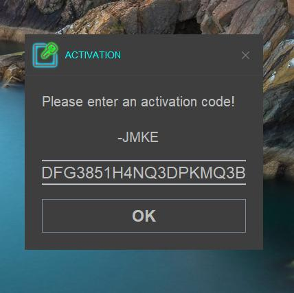
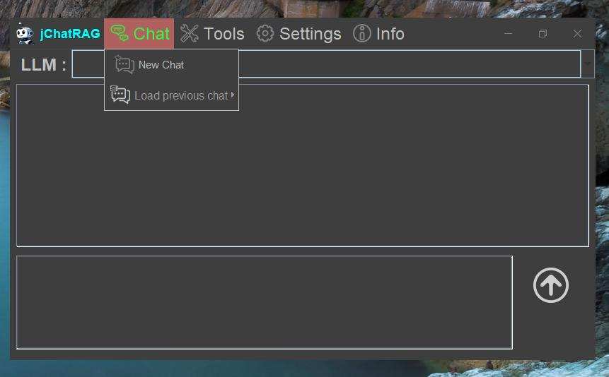
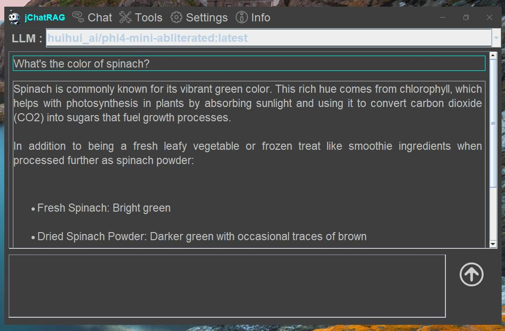
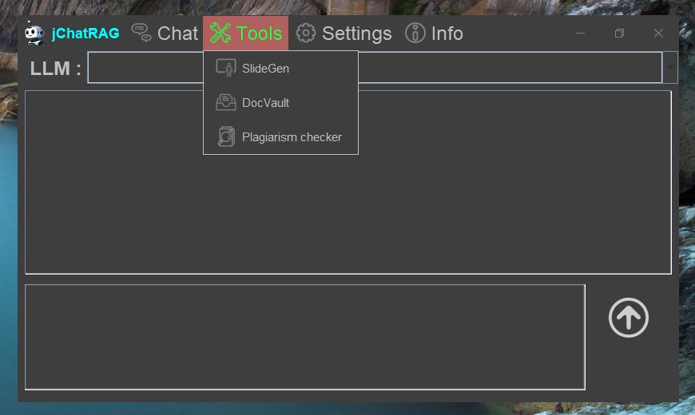
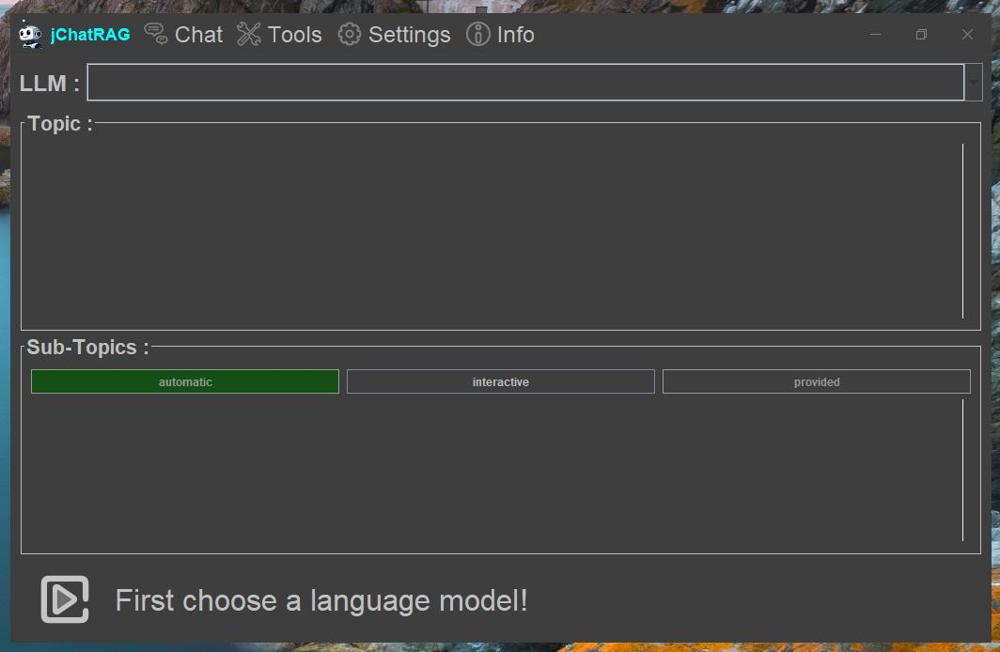
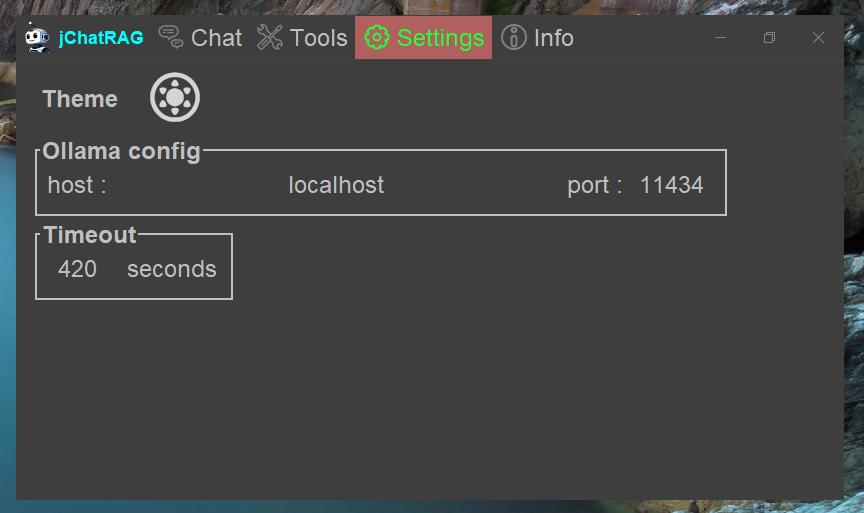

# jChatRAG

This project has been abandoned mainly because ollama now offers a nice gui for chatting with local LLMs.

## Original plan

Java app connecting to Ollama for chat including RAG and web search. Also makes content for presentation slides. At some point I also wanted to include a plagiarism checker ...

## What works?

The app connects to Ollama and uses it's REST API for chat completion via a local LLM. It also can make slides for presentations.

## Usage

### Activation

On the first start (or when the activation is expired) the app will first ask for an activation code. A key generator can be found [here](https://github.com/psilo-hub/jChatRagActivator).

### Chat

The chat panel allows to load and continue an old chat or start a new one. When starting a new one you first have to select a LLM.

### Tools

The only tool that's working is the slide generator which generates slides for presentations and saves the result in text and html files. Select the LLM to use, type the topic into the text area for it, choose a mode and let the LLM generate content.

#### SlideGen Modes

 - automatic : The LLM will come up with a list of sub-topics for the topic you have entered and then start to generate slides for each sub-topic.
 
 - interactive : The LLM will first come up with a list of sub-topics for the topic you have entered. You can modify these before telling the app to start generating slides for each sub-topic.
 
 - provided : Instead of letting the LLM suggest sub-topics, you provide a list. You can then tell the app to start generating slides for each sub-topic.
 
### Settings

Here you can switch between dark and light theme, configure where Ollama is running and define a timeout for responses.